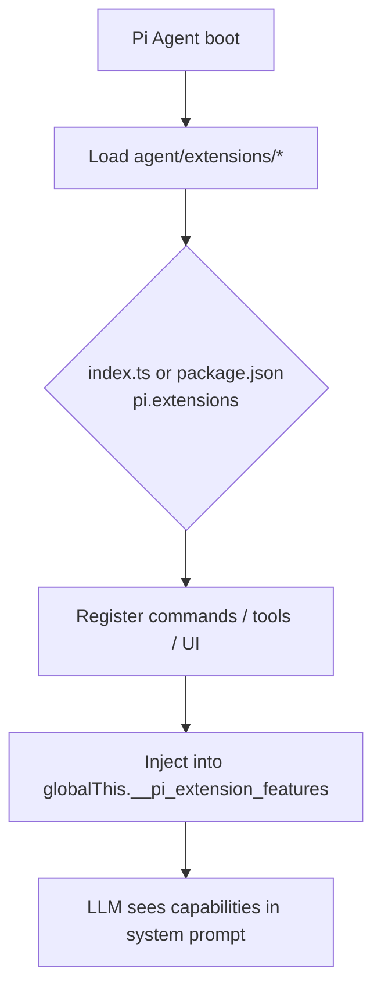
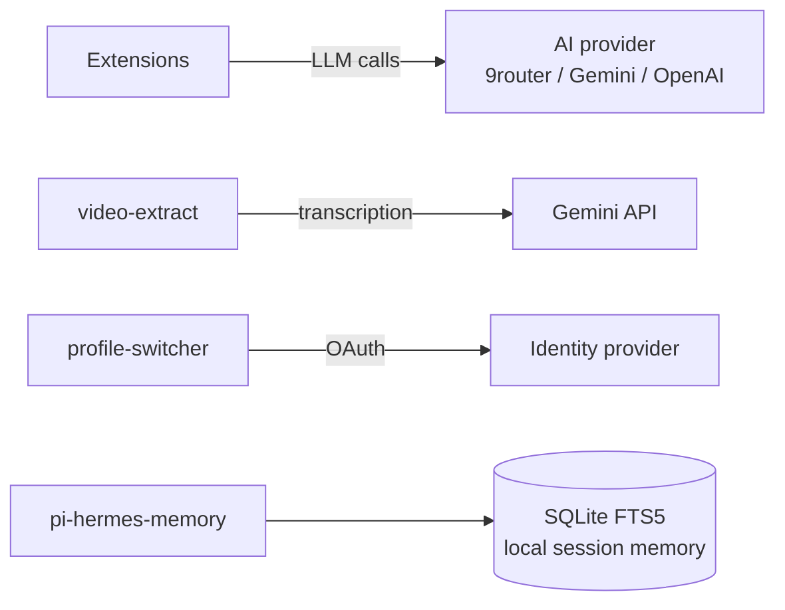

# Arete Architecture

Arete is a collection of self-contained extensions that plug into the Pi Agent at
runtime. This document describes how extensions load, how they share state, and which
external services they touch.

## Extension loading

Each extension lives in its own folder under `agent/extensions/<name>/` and is loaded
independently. If an extension is missing or its npm dependencies are absent, peers
degrade gracefully (`status: "degraded"` / `"disabled"`) instead of crashing the agent.

## Global state bridges

Extensions do not import sibling code directly. They communicate through
`globalThis` bridges keyed with the `__pi_` prefix:

| Bridge | Owner extension | Purpose |
|--------|----------------|---------|
| `__pi_extension_features` | core | Registry of loaded extension capabilities |
| `__pi_tui` | `tui` | Shared TUI components (Thinking, BoxedEditor, Questions) |
| `__pi_copilot_usage` | `context` | Token / request usage counters |
| `__pi_goal_state` | `goal` | Long-running objective state |

The bridge owner must load first; consumers read it at runtime.

## External service dependencies

- **AI providers**: configured per-extension via environment variables (see `.env.example`).
- **pi-hermes-memory**: persists locally to SQLite; no remote database.
- **Secrets**: never committed; supplied through `.env` (gitignored) or CI secrets.

## Guardrails

- All npm imports are wrapped in try/catch and guarded so a missing dependency cannot
  crash the host.
- Secret and prompt-injection scanning run inside `pi-hermes-memory` at runtime, and
  Gitleaks scans the repo in CI.
